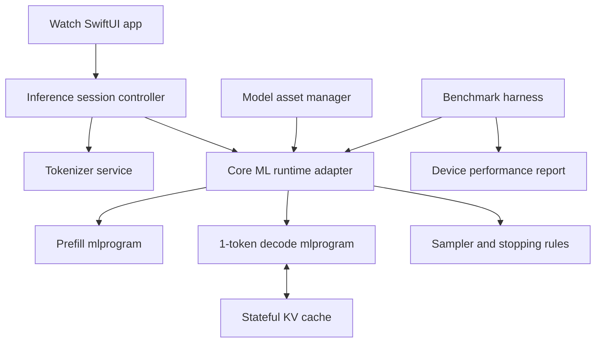

# Apple Watch SE MiniCPM5 Local Inference Design

Date: 2026-05-29
Status: Design draft
Repository: WatchLM

## Objective

Run `openbmb/MiniCPM5-1B` locally on Apple Watch SE-class hardware, with inference optimization that preserves as much of the original model capability as possible.

This design favors fidelity before aggressive compression. The system should first prove that the original 24-layer MiniCPM5-1B architecture can be made usable on watchOS through careful quantization, static-shape compilation, stateful decoding, and runtime limits. Structural model reduction is reserved for measured fallback paths.

## Source Facts

- MiniCPM5-1B is a standard `LlamaForCausalLM` model with 1,080,632,832 parameters, 24 layers, hidden size 1536, 16 query heads, 2 KV heads, and 131,072 maximum context.
- The official GGUF releases are approximately 688 MB for Q4_K_M, 1.15 GB for Q8_0, and 2.17 GB for F16.
- Apple Watch SE 2 has S8 SiP, a 64-bit dual-core processor, a 2-core Neural Engine, and 32 GB storage.
- Apple Watch SE 3 has S10, a 64-bit dual-core processor, a 4-core Neural Engine, and 64 GB storage.
- watchOS app upload limits make the main app bundle unsuitable for embedding a several-hundred-MB model. The model must be downloaded or installed as an asset after app installation.
- Core ML supports on-device generative models, model compression, transformer operations, and stateful model execution patterns that are applicable to KV-cache decoding.

References:

- https://huggingface.co/openbmb/MiniCPM5-1B
- https://huggingface.co/openbmb/MiniCPM5-1B-GGUF
- https://www.apple.com/apple-watch-se-3/specs/
- https://support.apple.com/en-us/111853
- https://developer.apple.com/help/app-store-connect/reference/app-uploads/maximum-build-file-sizes/
- https://developer.apple.com/machine-learning/core-ml/
- https://apple.github.io/coremltools/docs-guides/source/stateful-models.html
- https://apple.github.io/coremltools/source/coremltools.optimize.coreml.post_training_quantization.html

## Non-Goals

- Do not use iPhone, cloud, or LAN inference for the main path.
- Do not optimize for 131K context on Apple Watch SE.
- Do not start with layer pruning, hidden-size reduction, or a distilled sub-1B replacement.
- Do not treat llama.cpp CPU-only GGUF as the primary production path.
- Do not support long-form chat as the first user experience.

## Hardware Profiles

### SE 3 Target

SE 3 is the primary performance target because it exposes the strongest entry-level watch hardware: S10, 4-core Neural Engine, and 64 GB storage.

Expected viable path:

- Core ML `mlprogram`
- Mixed int4/int8 weight compression
- Int8 KV cache
- Static context lengths of 256, 512, and 1024
- Short No Think responses
- Optional speculative decoding after baseline decode works

### SE 2 Compatibility Target

SE 2 is a compatibility target and should be treated as constrained hardware: S8, 2-core Neural Engine, and 32 GB storage.

Expected viable path:

- Same model architecture and tokenizer when possible
- More conservative response lengths
- Smaller default context, likely 256 or 512
- Lower concurrency and more aggressive thermal throttling
- Speculative decoding only if memory and latency budgets allow

If SE 2 cannot meet the usability bar with full architecture and mixed quantization, the first fallback is lm_head optimization, not layer pruning.

## User Experience Envelope

The watch experience should be a short-answer assistant, not a full desktop chat agent.

Default generation settings:

- Mode: No Think
- Context: 512 tokens
- Maximum new tokens: 64
- Temperature: 0.3-0.7
- Top-p: 0.9-0.95
- Streaming UI: yes

Performance targets:

- First visible token: under 3 seconds on SE 3
- Sustained decode: at least 3 tokens per second on SE 3
- Response length: 32-96 tokens
- Five consecutive short turns without crash, watchdog termination, or severe thermal slowdown

SE 2 targets are softer:

- First visible token: under 5 seconds
- Sustained decode: at least 1.5-3 tokens per second
- Response length: 32-64 tokens

## Architecture



### App Layer

The watch app owns interaction, streaming, cancellation, and lifecycle control. It does not know model internals.

Responsibilities:

- Capture text input or dictation output.
- Start an inference session.
- Render streamed tokens.
- Provide cancellation before the next decode step.
- Surface model installation and thermal status.

### Model Asset Manager

The asset manager owns model availability outside the app bundle.

Responsibilities:

- Download or sideload model asset packs.
- Verify hash and manifest compatibility.
- Keep separate variants for SE 2 and SE 3 if necessary.
- Support deleting and reinstalling model assets.

The main app remains small. Large `.mlpackage` assets are installed into app storage after app installation.

### Tokenizer Service

The tokenizer preserves the original MiniCPM5 tokenizer for fidelity.

Responsibilities:

- Apply MiniCPM5 chat template with `enable_thinking=false`.
- Encode input IDs.
- Decode streamed token IDs.
- Enforce context-window trimming before prefill.

Implementation should avoid Swift string-heavy hot paths during decoding. The tokenizer can be native Swift if practical, or a small C++ tokenizers bridge if it materially reduces implementation risk.

### Runtime Adapter

The runtime adapter hides Core ML model invocation details.

Responsibilities:

- Select context variant: 256, 512, or 1024.
- Run prefill over the prompt.
- Run one-token decode with stateful KV cache.
- Expose timing metrics for every phase.
- Support CPU-only fallback only for diagnostics.

### Sampler

The sampler should remain simple and predictable.

Responsibilities:

- Greedy and top-p sampling.
- Temperature scaling.
- Stop-token handling.
- Repetition guard with a small rolling window.
- Maximum token cutoff.

Greedy mode is the first benchmark baseline because it isolates runtime speed from sampling overhead.

## Model Conversion Strategy

The conversion path should produce multiple artifacts from one source checkpoint:

1. Load MiniCPM5-1B BF16 from Hugging Face.
2. Wrap forward passes into prefill and decode graphs.
3. Add explicit or stateful KV cache support.
4. Convert to Core ML `mlprogram`.
5. Compress weights with a fidelity-first mixed precision policy.
6. Validate logits against the PyTorch reference.
7. Package model variants with manifests and hashes.

### Prefill Graph

Prefill consumes the full prompt and initializes KV cache.

Shape policy:

- Batch: 1
- Context variants: 256, 512, 1024
- Prompt length: padded or clipped to variant length

### Decode Graph

Decode consumes exactly one token and updates KV cache.

Shape policy:

- Batch: 1
- Query length: 1
- KV capacity: fixed by selected context variant

Stateful Core ML KV cache is preferred. If watchOS support or conversion limitations block stateful cache, use explicit KV input/output tensors as the fallback and measure the copy overhead.

## Quantization Strategy

The first version should use layer-wise sensitivity search instead of uniform low-bit quantization.

### Fidelity-First Baseline

Keep higher precision where quantization damage is most visible:

- Embedding: int8 or fp16
- lm_head: int8 or mixed int8/int4
- First two transformer layers: int8 where needed
- Last two transformer layers: int8 where needed
- Norms: fp16
- Attention Q/K/O projections: int8 if sensitivity is high
- FFN projections: int4 first

Candidate baseline:

- FFN `up`, `gate`, `down`: int4
- Attention `V`: int4 or int8 after sensitivity test
- Attention `Q`, `K`, `O`: int8 until proven safe
- Embedding and lm_head: int8
- Norms and scalar constants: fp16
- KV cache: int8

### Quantization Recovery

Post-training compression alone may not preserve a 1B model well enough. The design includes a recovery phase:

- Use BF16 MiniCPM5-1B as teacher.
- Build a calibration set of short Chinese, English, coding, instruction-following, and watch-oriented prompts.
- Compare top-k logits and next-token KL divergence.
- Apply quantization-aware fine-tuning or adapter-based recovery if conversion supports it.
- Re-export Core ML after recovery.

### KV Cache Compression

KV cache should start at int8 to preserve quality. Int4 KV is an experiment after int8 is stable.

Approximate FP16 KV cost:

```text
24 layers * 2 tensors(K,V) * 2 kv heads * 128 head dim * 2 bytes = 24 KB/token
```

Implications:

- 256 tokens: about 6 MB
- 512 tokens: about 12 MB
- 1024 tokens: about 24 MB

This is acceptable only if model weights and runtime buffers stay under watchOS memory pressure. Int8 KV roughly halves this budget.

## lm_head Optimization Without Hard Vocabulary Pruning

MiniCPM5-1B has a large vocabulary and untied embeddings. The lm_head can dominate per-token decode cost. Because preserving model capability is a priority, hard vocabulary pruning is deferred.

Preferred options:

1. Keep full lm_head int8 for the first fidelity baseline.
2. Try low-rank lm_head factorization with distillation recovery.
3. Try candidate-token projection: a smaller scorer proposes candidate IDs, then the full head scores only the candidate set.
4. Use hard vocabulary pruning only if SE 2 cannot meet minimum usability after the above options.

Low-rank lm_head is the first structural optimization because it targets decode cost without changing transformer depth or hidden dynamics.

## Speculative Decoding

Speculative decoding is the preferred speed path after baseline correctness because it can preserve the original model as verifier.

Design:

- Full MiniCPM5-1B remains the verifier.
- A small draft model proposes 2-4 tokens.
- The verifier validates draft tokens in a batched step.
- If rejected, fallback to verifier token.

Benefits:

- Preserves verifier distribution when implemented correctly.
- Improves perceived speed on short responses.
- Lets SE 3 trade a small extra model for fewer verifier invocations.

Risks:

- Extra memory for draft model.
- More complex Core ML graph orchestration.
- Less likely to fit SE 2 without careful sizing.

This is phase-two optimization, not part of the first correctness milestone.

## Runtime and Lifecycle Constraints

watchOS may suspend or terminate resource-heavy work. The runtime should act like a foreground short task.

Rules:

- Keep inference foreground-driven.
- Cancel promptly when the user exits.
- Avoid background generation.
- Keep per-response budgets short.
- Record CPU, memory, energy, and thermal state during benchmarks.
- Surface a degraded mode if thermal pressure rises.

Extended runtime sessions are not a license to run sustained high CPU workloads. They may be useful for controlled testing but should not be required for normal inference.

## Benchmark Plan

The benchmark harness is a first-class deliverable because architecture choices need device evidence.

Metrics:

- Model load time
- Prefill latency
- First token latency
- Decode tokens per second
- Peak resident memory
- Energy impact proxy from Instruments
- Thermal state transitions
- Crashes, watchdog exits, and Core ML errors
- Quality drift versus BF16 teacher

Benchmark prompts:

- Chinese short Q&A
- English short Q&A
- Bilingual translation
- Short coding explanation
- Reasoning without Think mode
- Watch-specific command phrasing

Each benchmark should run on:

- SE 3, context 256/512/1024
- SE 2, context 256/512 if available
- Greedy sampling baseline
- Default sampling profile

## Error Handling

Model installation:

- Missing asset: show install prompt.
- Hash mismatch: delete and reinstall.
- Unsupported watch profile: show unsupported variant message.
- Insufficient storage: show storage requirement and cleanup option.

Inference:

- Core ML load failure: report model variant and OS version.
- Decode failure: stop session and preserve diagnostics.
- Thermal pressure: reduce max tokens or context for next run.
- User cancellation: stop at next token boundary.

## Testing Strategy

Unit tests:

- Tokenizer round-trip for representative prompts.
- Chat template generation with `enable_thinking=false`.
- Sampling determinism for greedy mode.
- Manifest parsing and hash validation.

Conversion tests:

- PyTorch vs Core ML logits tolerance for prefill.
- PyTorch vs Core ML logits tolerance for decode after KV update.
- Quantized model top-k agreement against teacher.

Device tests:

- Install model asset.
- Load model.
- Generate 32 tokens.
- Cancel mid-generation.
- Run five-turn short conversation.
- Run thermal stress benchmark.

## Implementation Phases

### Phase 1: Repository and Documentation

Create the project docs, architecture design, and implementation plan.

Exit criteria:

- Design document committed.
- Implementation plan committed.

### Phase 2: Benchmark and Conversion Tooling

Build host-side scripts for model metadata inspection, conversion planning, benchmark prompt sets, and artifact manifests.

Exit criteria:

- Scripts can validate model metadata.
- Manifest format is defined and tested.
- Benchmark prompt set exists.

### Phase 3: watchOS Shell and Asset Manager

Create the watchOS app shell and model asset manager.

Exit criteria:

- App launches on simulator.
- Asset manifest can be loaded.
- Missing model state is represented in UI.

### Phase 4: Tokenizer and Runtime Interfaces

Implement tokenizer and runtime abstractions behind testable protocols.

Exit criteria:

- Tokenizer tests pass.
- Runtime adapter can use a mock model.
- UI can stream mock tokens.

### Phase 5: Core ML Baseline Integration

Integrate a tiny Core ML language-model-like smoke-test artifact first, then swap in MiniCPM-derived artifacts as conversion succeeds.

Exit criteria:

- Device can load a Core ML artifact.
- Runtime measures prefill/decode timings.
- Diagnostics are persisted.

### Phase 6: MiniCPM5 Quantized Artifact

Convert and package the first MiniCPM5-1B Core ML artifact.

Exit criteria:

- Artifact loads on SE target.
- Generates valid text.
- Baseline benchmark report exists.

### Phase 7: Fidelity and Speed Optimization

Iterate mixed precision, KV cache compression, lm_head optimization, and speculative decoding.

Exit criteria:

- Best-known SE 3 profile meets target or documents blockers.
- Best-known SE 2 profile meets compatibility target or documents fallback decision.
- Quality drift report exists.

## Key Decisions

- Primary runtime: Core ML, not GGUF CPU.
- Primary optimization goal: preserve original model architecture.
- First compression target: mixed weight quantization, not pruning.
- First context target: 512 tokens.
- First speed target after baseline: stateful decode, then lm_head optimization, then speculative decoding.
- First fallback for SE 2: lower context and lm_head optimization, not layer removal.

## Open Risks

- Core ML stateful KV cache support on watchOS may be less capable than on iOS/macOS.
- The full model may exceed practical watchOS memory budgets even at mixed int4/int8.
- Neural Engine scheduling for LLM decode on Apple Watch may not provide enough throughput for the target.
- Model asset distribution may require a non-bundle install path and careful App Store review positioning.
- SE 2 may require a product-specific fallback despite preserving architecture as long as possible.

## Approval Gate

Implementation should begin only after this design is reviewed. If the design is accepted, the next artifact is a detailed implementation plan with small, commit-sized milestones.
